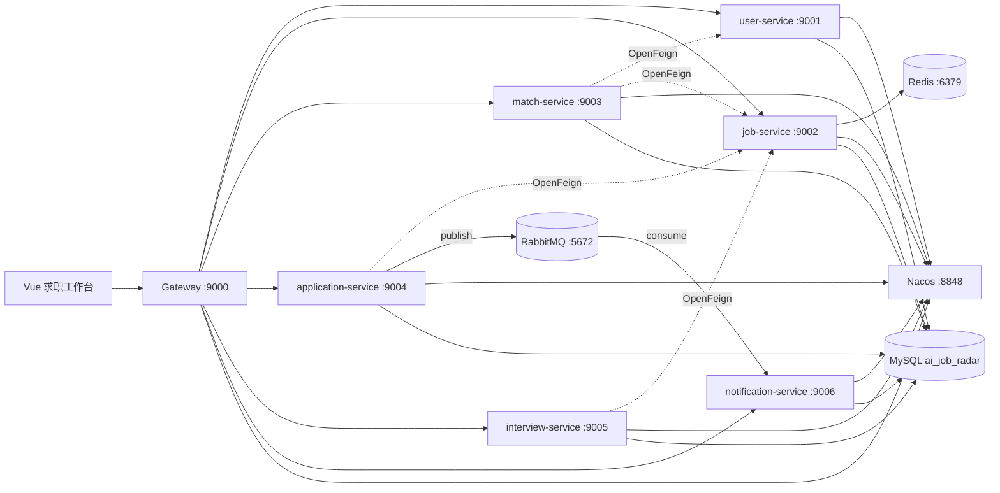

# AI 求职雷达（课程框架版）

AI 求职雷达面向高校求职者，将职位检索、可解释匹配、收藏投递、进度管理和模拟面试串成一条完整求职流程。本版本严格参照课程前三天代码重构，保留原项目核心业务，移除 BOSS 自动化等不适合课程汇报的复杂功能。

## 技术路线

| 层级 | 技术与版本 | 课程对应 |
| --- | --- | --- |
| 前端 | Vue 3.5.38、Vue Router 4.6.4、Axios 1.18.1、Vite 8.0.16 | `my-vue.zip` |
| 微服务 | Spring Boot 2.3.12.RELEASE、Spring Cloud Hoxton.SR12 | day03 / `mall-parent` |
| 服务治理 | Spring Cloud Alibaba 2.2.9.RELEASE、Nacos 2.1.0、Gateway、OpenFeign | day03 |
| 数据访问 | MyBatis-Plus 3.3.1、MySQL Connector 8.0.26 | day01-day03 |
| 缓存与消息 | Redis（职位缓存）、RabbitMQ（投递状态异步通知） | day01 第 3 页 |
| 基础环境 | JDK 17 编译（Java 8 target）、MySQL 8、Node.js | 课程环境 |

项目完整覆盖课程规定的必选技术栈；不加入可选 Elasticsearch 和 Docker，以降低答辩现场依赖与演示风险。

## 系统架构



后端所有服务均采用课程中的 Controller → Service → Mapper → MySQL 分层，响应统一封装为 `CommonResult`，JWT 登录态通过拦截器校验。

## 业务功能

- 登录与求职画像：维护目标岗位、城市、技能、经验、学历和薪资。
- 职位雷达：按关键词、城市、最低薪资分页检索 12 条演示职位。
- 智能匹配：按技能 60%、城市 15%、薪资 15%、经验 10% 生成可解释报告。
- 收藏与投递：收藏岗位，投递后在五阶段看板更新状态。
- 模拟面试：按岗位生成 4 道题，逐题评分并生成反馈与总分。
- 消息中心：异步接收投递与进度变化通知，支持未读、单条已读和全部已读。

## 目录结构

```text
ai-job-radar-course/
├─ ai-job-radar-parent/       # Maven 聚合工程
│  ├─ common/                 # 统一结果、JWT、异常处理、共享 VO
│  ├─ gateway/                # API 网关与跨域配置
│  ├─ user-service/           # 用户与画像
│  ├─ job-service/            # 职位检索
│  ├─ match-service/          # 可解释匹配
│  ├─ application-service/    # 收藏与投递进度
│  ├─ interview-service/      # 模拟面试
│  └─ notification-service/   # RabbitMQ 异步消息中心
├─ ai-job-radar-web/          # Vue 3 前端
├─ sql/ai_job_radar.sql       # 建库、建表和演示数据
├─ scripts/                   # 本地启动脚本
└─ docs/课程汇报说明.md
```

## 本地启动

### 1. 准备环境

- JDK 17
- Maven 3.8+
- Node.js 24（或满足 `package.json` 中 engines 的版本）
- MySQL 8，演示配置为 `root/root`
- Nacos 2.1.0
- Redis（默认 `localhost:6379`）
- RabbitMQ（默认 `guest/guest@localhost:5672`）

演示账号：`student / 123456`。数据库密码和 JWT 密钥仅用于本地课程演示，部署前应改为环境变量或配置中心参数。

### 2. 初始化数据库

```bash
mysql --default-character-set=utf8mb4 -uroot -proot < sql/ai_job_radar.sql
```

### 3. 启动 Nacos

进入 Nacos 的 `bin` 目录：

```bash
# Windows
startup.cmd -m standalone

# macOS / Linux
sh startup.sh -m standalone
```

访问 `http://localhost:8848/nacos/`，确认注册中心可用。

### 4. 启动后端

```bash
cd ai-job-radar-parent
mvn clean package
```

先检查依赖，再运行 Gateway 和 6 个业务服务：

```powershell
..\scripts\check-environment.ps1
..\scripts\start-backend.ps1
```

服务端口为 9000–9006。若端口被其他课程项目占用，可用 `--server.port=新端口` 临时覆盖；通过 Nacos 服务名调用时，Gateway 和 OpenFeign 无需修改。

### 5. 启动前端

```bash
cd ai-job-radar-web
npm install
npm run dev
```

浏览器打开 `http://localhost:5173`。生产构建使用 `npm run build`。

## 自动化验证

```bash
mvn -f ai-job-radar-parent/pom.xml clean test
npm --prefix ai-job-radar-web run build
```

已覆盖统一响应、JWT、拦截器、异常处理、用户、职位、匹配、收藏、投递、面试评分和 Gateway 路由测试。

## 课堂演示顺序

1. 登录后介绍 Gateway、Nacos 中的 6 个业务服务和总览页面。
2. 在职位雷达筛选岗位，生成一份可解释匹配报告。
3. 收藏岗位并点击“投递”，在消息中心展示 RabbitMQ 异步通知，再在进度看板改为“面试中”。
4. 从职位卡片创建模拟面试，回答问题并查看即时反馈。
5. 展示 Mapper、Service、OpenFeign 和 Vue Axios 代码，说明与课程路线的对应关系。

更完整的汇报结构和团队分工见 [课程汇报说明](docs/课程汇报说明.md)。
