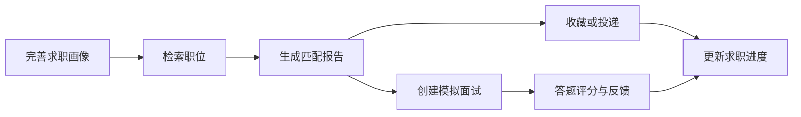

# AI 求职雷达课程汇报说明

## 项目简介（组队表约 50 字）

面向高校求职者的智能求职管理系统，提供职位检索、能力画像、可解释匹配、收藏投递、进度看板和模拟面试，帮助学生更有依据地选择岗位并管理求职全过程。

## 立项意义

招聘平台信息量大，但学生往往难以判断岗位是否适合自己，也容易遗漏收藏、投递、面试等关键节点。本项目用个人画像与岗位要求做规则化匹配，并把分散的求职行为放进同一工作台。项目重点不是堆叠功能，而是完整应用课程讲授的前后端分离与微服务技术路线。

## 技术路线与课程对应

1. Vue 3、Vue Router、Axios 完成单页应用、路由和接口请求，对应前端课程示例。
2. Spring Boot Controller、Service、Mapper 分层和 MyBatis-Plus，对应 day01 单体项目基础。
3. Maven 父工程、Nacos、Gateway、OpenFeign，对应 day03 `mall-parent` 微服务拆分。
4. MySQL 保存用户、职位、匹配、收藏、投递和面试数据，统一结果对象和 JWT 拦截器负责通用能力。

## 推荐五人分工

分工按功能模块划分，每位成员都覆盖前端、后端和数据库，不设置“只做登录”或“只写文档”的角色。

| 成员 | 负责模块 | 前后端工作 |
| --- | --- | --- |
| 成员1（队长） | 用户画像与系统集成 | 登录/画像页面、user-service、JWT、Gateway 联调、进度管理 |
| 成员2 | 职位雷达 | 搜索筛选页面、job-service、职位表和分页查询 |
| 成员3 | 智能匹配 | 匹配报告页面、match-service、OpenFeign、评分规则 |
| 成员4 | 收藏与投递 | 收藏/看板页面、application-service、状态流转 |
| 成员5 | 模拟面试 | 面试训练页面、interview-service、题目与评分反馈 |

若团队有 4 人，可由成员1兼任职位模块；若有 6 人，可将系统测试、演示数据和部署文档独立为“质量与交付”模块，但仍需参与一个业务模块实现。

## 核心业务闭环

## 匹配规则

- 技能匹配 60 分：将岗位要求拆分为关键词，与用户技能逐项比对。
- 城市匹配 15 分：期望城市与岗位城市一致得分。
- 薪资匹配 15 分：岗位最高薪资达到用户最低期望得分。
- 经验匹配 10 分：用户经验达到岗位要求得分。

这种规则便于课堂解释、单元测试和现场演示，比不可解释的随机“AI 分数”更稳妥。

## 建议演示脚本（8–10 分钟）

1. 1 分钟：介绍痛点、功能边界和技术路线。
2. 1 分钟：展示 Nacos 服务列表、Gateway 路由和 Maven 模块结构。
3. 2 分钟：登录、画像和职位搜索。
4. 2 分钟：生成匹配报告，解释四维评分。
5. 2 分钟：收藏、投递和进度看板。
6. 1 分钟：创建模拟面试并展示评分反馈。
7. 1 分钟：展示 Controller/Service/Mapper/OpenFeign 代码与测试结果。

## 可减少但不建议增加的功能

时间不足时，可减少职位详情弹窗、复杂筛选项或面试历史样式，但应保留五个成员对应的业务模块。不要在本轮加入 BOSS 自动投递、即时聊天、Redis、RabbitMQ、Docker 等功能，以免偏离前三天课程内容和汇报重点。
